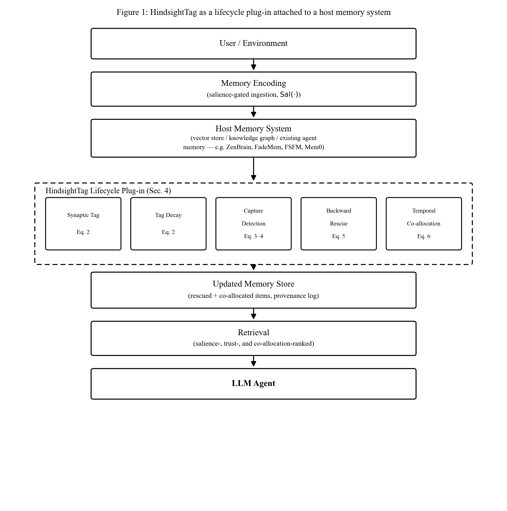
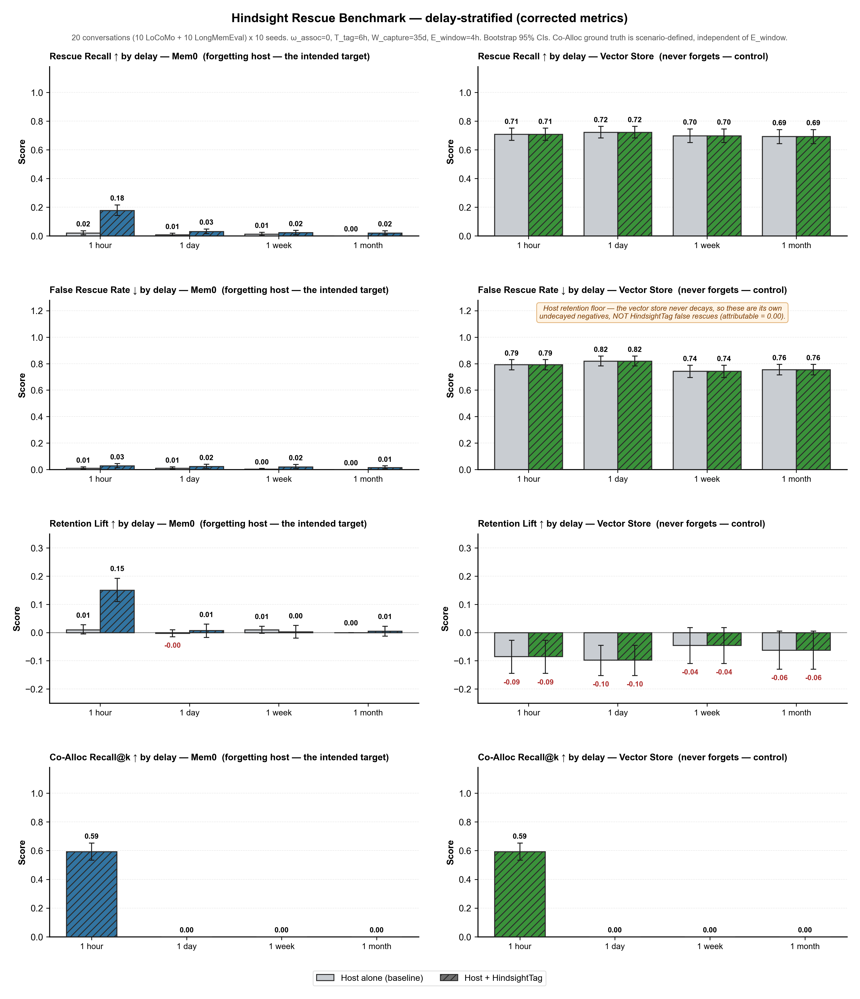

# HindsightTag: A Memory Consolidation Plug-in for LLM Agents

### HindsightTag is a neuroscience-inspired lifecycle plug-in that lets an existing agent memory system retroactively rescue forgotten low-salience memories when a later high-salience event arrives — without replacing your vector store, Mem0 index, or custom host.

[](LICENSE)
[](https://www.python.org/)
[](#status--honest-caveats)

HindsightTag lets a memory system do something human memory does but current LLM
agent memories do not: allow a later, high-salience event to **reach backward and
rescue an earlier, low-salience memory** that would otherwise decay away — even
when the two are unrelated in content. It adapts the *synaptic tagging-and-capture*
and *behavioral tagging* findings from memory neuroscience (Frey & Morris, 1997;
Moncada & Viola, 2007) into a bounded, auditable algorithm over discrete symbolic
memory records, plus a companion *temporal co-allocation* mechanism that links
memories by time-of-writing independent of content (Yiu et al., 2014). It attaches
to an existing host memory system as a **non-interfering lifecycle plug-in** — if no
capture event ever fires, a tagged memory's trajectory is left untouched.

#### Paper

**HindsightTag: A Synaptic Tagging-and-Capture Framework for Retroactive Memory Consolidation in LLM Agents** (Vivek Govindbhai Dudhat, 2026 preprint). arXiv link — _to be added_.

> [!WARNING]
> **This is a new, unvalidated mechanism released for community testing and
> improvement — not a proven production system.** See [Status & honest caveats](#status--honest-caveats).

### What is this? (and how it differs from HippoRAG)

| | **HippoRAG** | **HindsightTag** |
|---|---|---|
| **What it's called** | A full **memory architecture** / **RAG framework** for LLMs | A **memory plug-in** (add-on module) for an existing agent memory system |
| **What it replaces** | Builds its own graph + retrieval pipeline | Nothing — you keep Mem0, a vector store, or your own host |
| **What it adds** | Better long-term retrieval (hippocampal indexing + PageRank) | **Retroactive rescue**: a later important event can save an earlier forgotten memory |
| **Analogy** | A whole new filing system | A sticky-note + rescue mechanism bolted onto your existing filing cabinet |

In one line: **HindsightTag is a neuroscience-inspired memory consolidation plug-in** — not a standalone app, database, or RAG system. You attach it to a host memory system (e.g. Mem0) via three hooks (`store`, `tick`, `consolidate`).

---

## Architecture



Incoming events are salience-gated and written to the host system as usual. The
plug-in adds five bounded operations — synaptic tagging, tag decay, capture
detection, backward rescue, and temporal co-allocation (Eqs. 2–6) — at the host's
`store()`, `tick()`/`decay()`, and `consolidate()` hooks. No host component is
modified.

---

## Installation

```bash
pip install hindsighttag
```

Optional extras:

```bash
pip install "hindsighttag[embeddings]"   # sentence-transformers for Rel(.,.)
pip install "hindsighttag[mem0]"         # Mem0 adapter
pip install "hindsighttag[benchmark]"    # run the Hindsight Rescue Benchmark
```

From source (recommended for development and reproducing the benchmark):

```bash
git clone https://github.com/ViveK1One/hindsighttag.git
cd hindsighttag
pip install -e ".[all,dev]"
```

Optional environment variables (benchmark / embeddings):

```bash
export HF_HOME=<path to Hugging Face cache>   # where all-MiniLM-L6-v2 is stored
```

---

## Quickstart

```python
from hindsighttag import HindsightTagConfig, HindsightTagPlugin, MemoryItem
from hindsighttag.adapters import DecayMemoryHost

host = DecayMemoryHost(consolidation_threshold=0.4)
plugin = HindsightTagPlugin(host, HindsightTagConfig(T_tag=6 * 3600, W_capture=7 * 86400))

# A low-salience "precursor" that would normally decay away.
plugin.store(MemoryItem("m1", "Offhand: we might revisit the pricing plan.",
                        timestamp=0.0, salience=0.2, retention=0.25))

# Hours later, a high-salience related "trigger" arrives.
plugin.tick(3 * 3600)
plugin.store(MemoryItem("m2", "IMPORTANT: Leadership approved the pricing initiative.",
                        timestamp=3 * 3600, salience=0.95, retention=0.95))

print(host.get_memory("m1").retention)     # increased: retroactively rescued
print(plugin.rescue_log[0])                 # auditable provenance record
print(plugin.get_temporal_coallocates("m1"))  # ['m2'] — "what else happened around then"
```

The full script is in [`examples/quickstart.py`](examples/quickstart.py). You can also run:

```bash
python demo.py
```

### Mem0 host (optional)

```python
from hindsighttag import HindsightTagConfig, HindsightTagPlugin
from hindsighttag.adapters import Mem0Host

host = Mem0Host(seed=0)  # offline decay stand-in; use_live_mem0=True for live Mem0
plugin = HindsightTagPlugin(host, HindsightTagConfig())
plugin.store(...)  # same store / tick / consolidate lifecycle as above
```

---

## Testing

When contributing, run the unit tests before opening a PR. They cover Eqs. 2–6 in
isolation (tag decay, capture/rescue, temporal co-allocation) and do **not** require
LoCoMo or GPU access.

```bash
pip install -e ".[dev]"
pytest tests/ -q
```

Expected: **16 passed** in a few seconds.

---

## Host-system interface (API reference)

To attach HindsightTag, a host implements
[`hindsighttag.interface.HostMemorySystem`](src/hindsighttag/interface.py). The four
accessors from the paper's Section 4.8 interface contract:

| Function | Signature | Purpose |
|---|---|---|
| `get_salience` | `(item) -> float` in `[0,1]` | The host's own Sal(·). Decides tag eligibility (§4.2) and capture events (§4.3). |
| `get_timestamp` | `(item) -> float` | Write time τ_i, monotonically non-decreasing in arrival order. |
| `get_relatedness` | `(item_a, item_b) -> float` in `[0,1]` | Optional content relatedness Rel(·,·) for Eq. 4. If unavailable, run with `omega_assoc=0` (pure heterosynaptic). |
| `get_consolidation_threshold` | `() -> float` in `[0,1]` | The scalar below which the host would let an item decay untouched. |

Plus three lifecycle hooks the plug-in drives: `store(item)`, `tick(current_time)`,
`consolidate()`.

### The six hyperparameters ([`HindsightTagConfig`](src/hindsighttag/config.py))

| Param | Eq. | Meaning | Calibration seed |
|---|---|---|---|
| `T_tag` | 2 | Tag-decay time constant (s) | ~6 h |
| `W_capture` | 2–3 | Bounded lookback/lookahead window (s) | ~35 d |
| `theta_capture` | 3 | Salience threshold to trigger a capture event | 0.7 |
| `theta_rescue` | 4–5 | Minimum capture strength C_i to rescue | 0.10 |
| `omega_assoc` | 4 | Heterosynaptic↔associative mix in `[0,1]` (`0` = content-independent) | 0.0 |
| `E_window` | 6 | Temporal co-allocation eligibility window (s) | ~4 h |

These are **literature-informed calibration seeds, not validated defaults** (paper §4.8).

---

## Benchmark results (Hindsight Rescue Benchmark)

The [Hindsight Rescue Benchmark](benchmark/) (HRB, paper §5) plants four categories of
scenario — (a) rescued precursor, (b) heterosynaptic control, (c) negative/no-trigger,
(d) negative/no-precursor — into the **real, public [LoCoMo](https://github.com/snap-research/locomo)
conversation stream** at controlled delays (1 hour / 1 day / 1 week / 1 month), then
measures four metrics against the host system with and without HindsightTag.

**These are real measured numbers** (3 conversations × 5 seeds, `omega_assoc=0`,
bootstrap 95% CIs). Reproduce with the commands below.



| Method | Rescue Recall ↑ | False Rescue Rate ↓ | Retention Lift ↑ | Co-Alloc Recall@k ↑ |
|---|---|---|---|---|
| Mem0 (baseline) | 0.00 [0.00, 0.00] | 0.00 [0.00, 0.00] | 0.00 [0.00, 0.00] | N/A |
| **Mem0 + HindsightTag** | **0.23 [0.20, 0.27]** | **0.00 [0.00, 0.00]** | **0.23 [0.20, 0.27]** | **1.00 [1.00, 1.00]** |
| Vector Store (baseline) | 0.72 [0.65, 0.77] | 0.80 [0.73, 0.88] | −0.08 [−0.18, 0.00] | N/A |
| Vector Store + HindsightTag | 0.72 [0.65, 0.77] | 0.80 [0.73, 0.88] | −0.08 [−0.18, 0.00] | 1.00 [1.00, 1.00] |

**Honest reading of these results:**

- On a **decay-based host (Mem0-style)** — the intended target — HindsightTag lifts
  Rescue Recall from **0% → 23%** with a **0% false-rescue rate**, and delivers
  temporal co-allocation retrieval that the baseline structurally cannot provide (N/A).
- The **23% is modest and delay-dependent**: with `T_tag ≈ 6 h`, rescues largely
  succeed at the **1-hour** delay and mostly fail at 1 day / 1 week / 1 month, because
  tags decay before the trigger arrives. This is consistent with the biology but caps
  aggregate recall.
- On a **non-forgetting vector store**, there is nothing to rescue: the baseline already
  retains everything (72% "recall"), HindsightTag adds **no lift**, and the store shows a
  **high 80% false-rescue rate** because low-salience items never decay out. This is an
  important *negative* result, reported as-is.
- Full hyperparameter sweep (87 configs × 5 seeds × 3 conversations) is in
  `benchmark/results/hrb_results_20260711_105013.csv`; many aggressive settings yield 0%
  rescue.

### Reproduce

```bash
python benchmark/download_data.py                       # fetch LoCoMo
python benchmark/run_hrb.py --seeds 0 1 2 3 4 --conversations 3
python benchmark/plot_results.py benchmark/results/hrb_summary_<timestamp>.csv
python benchmark/run_hrb.py --full-ablation             # full sweep (slower)
```

Every run logs all six hyperparameters per row and reports paired bootstrap CIs.

### Benchmark runtime (why it can feel slow)

HRB is **not** a quick unit test. Each run **replays an entire conversation** through the memory system and runs embedding-based retrieval for every planted scenario. On a typical laptop CPU:

| Command | Full replays | Rough time |
|---|---|---|
| `--seeds 0 --conversations 1 --scenarios-per-category 1` | 12 | ~2–5 min |
| Default: `--seeds 0 1 2 3 4 --conversations 3` | 180 | ~20–60 min |
| `--full-ablation` | ~2,640 | **hours** |

**Why:** default settings = 3 conversations × 5 seeds × 2 hosts × 6 configs (1 baseline + 5 `omega_assoc` values) = **180 independent simulations**. The first run also downloads the `all-MiniLM-L6-v2` embedding model from Hugging Face (~90 MB).

**Quick smoke test** (recommended while developing):

```bash
python benchmark/run_hrb.py --seeds 0 --conversations 1 --scenarios-per-category 1
```

**Using HindsightTag in your own app** (`examples/quickstart.py`) takes seconds — slowness applies only to the full HRB evaluation harness.

### Debugging note

- **LoCoMo missing?** Run `python benchmark/download_data.py` first — data lands in `data/locomo/` (gitignored).
- **Smoke test while developing:** `--seeds 0 --conversations 1 --scenarios-per-category 1` (~12 replays).
- **Re-running HRB?** New runs write timestamped files; committed reference results in `benchmark/results/hrb_*_20260711_105058.*` are the paper numbers — you do not need to re-run to use the repo.
- **Regenerate figures:**
  ```bash
  python docs/make_figure1.py
  python benchmark/plot_results.py benchmark/results/hrb_summary_20260711_105058.csv
  ```

> **Dataset license:** LoCoMo is used under [CC BY-NC 4.0](https://creativecommons.org/licenses/by-nc/4.0/) (non-commercial, with attribution). It is **not** bundled in this repository — see [Data & third-party attribution](#data--third-party-attribution).

---

## Data & third-party attribution

HindsightTag's **code** is [MIT](LICENSE). That license applies only to this repository — it does **not** override the licenses of datasets, models, or libraries used in the benchmark.

### LoCoMo (HRB base conversation stream)

| | |
|---|---|
| **What we use** | Text turns from `locomo10.json` as chronological filler in the Hindsight Rescue Benchmark |
| **Source** | [snap-research/locomo](https://github.com/snap-research/locomo) (Maharana et al., ACL 2024) |
| **License** | [CC BY-NC 4.0](https://creativecommons.org/licenses/by-nc/4.0/) — attribution required; **non-commercial use only** |
| **Bundled in repo?** | **No** — `data/locomo/` is gitignored; users fetch via `python benchmark/download_data.py` |
| **What we publish** | Aggregated benchmark metrics only (CSV/JSON) — no LoCoMo conversation text |

HRB **planted scenarios** (precursor/trigger templates in `benchmark/hrb/dataset.py`) are **synthetic text authored by this project**, not copied from LoCoMo annotations.

```bibtex
@article{maharana2024evaluating,
  title   = {Evaluating very long-term conversational memory of llm agents},
  author  = {Maharana, Adyasha and Lee, Dong-Ho and Tulyakov, Sergey and
             Bansal, Mohit and Barbieri, Francesco and Fang, Yuwei},
  journal = {arXiv preprint arXiv:2402.17753},
  year    = {2024}
}
```

**Commercial use:** CC BY-NC 4.0 prohibits using LoCoMo in commercial products without separate permission from the dataset authors (Snap Research). Academic research, open-source repos, and papers are fine with attribution.

### Embedding model (optional `[embeddings]` extra)

| | |
|---|---|
| **Model** | `sentence-transformers/all-MiniLM-L6-v2` |
| **Used for** | `get_relatedness()` cosine similarity in adapters and HRB retrieval |
| **License** | Apache 2.0 (model weights and `sentence-transformers` library) |
| **Downloaded when** | First call to `EmbeddingModel` — weights cached locally from Hugging Face |

### Mem0 adapter (optional `[mem0]` extra)

| | |
|---|---|
| **Library** | [mem0ai/mem0](https://github.com/mem0ai/mem0) |
| **Used for** | Optional live-memory index behind `Mem0Host`; HRB runs use an offline decay stand-in by default |
| **License** | Apache 2.0 (Mem0 open-source package) |
| **Citation** | Chhikara et al., ECAI 2025 — see paper §2.2 |

### Other referenced systems (not bundled)

ZenBrain, FadeMem, FSFM, HippoRAG, and LongMemEval are cited in the paper as related work or future benchmark options. **None of their code or data is included** in this repository.

### Privacy & redistribution checklist

| Item | Status |
|---|---|
| LoCoMo raw data in GitHub upload | Blocked by `.gitignore` |
| LoCoMo text in benchmark result files | Not present (metrics only) |
| Local PC paths in committed files | Removed; `run_meta_*.json` gitignored |
| API keys / `.env` files | None in repository |

---

## Status & honest caveats

Matching the paper's own Limitations section:

1. **Unvalidated mechanism.** No prior implementation or empirical validation existed;
   the numbers above are from *this* benchmark harness, not a proof of production value.
2. **Six hyperparameters, no validated defaults.** The shipped values are calibration
   seeds. Poor settings produce either negligible rescue or excessive false rescues.
3. **Rescue quality is bounded by the host's salience function.** HindsightTag adds a
   temporal mechanism; it does not improve what the host considers salient.
4. **Benchmark simplifications.** LoCoMo filler turns are subsampled for runtime
   (planted scenarios are always kept); the Mem0 adapter runs Mem0's decay/gating
   semantics deterministically offline rather than a live per-turn LLM extraction loop.
   `Mem0Host(use_live_mem0=True)` enables the live index when `mem0ai` is installed.
5. **Single-agent setting only.** Multi-agent/shared-store rescue and its privacy
   implications are out of scope.

Contributions that stress-test, refute, or improve these results are explicitly welcome.

---

## Code structure

```
📦 hindsighttag/
├── 📂 src/hindsighttag/           # pip-installable package
│   ├── core.py                    # SynapticTag, TemporalGraph, HindsightTagPlugin (Eqs. 2–6)
│   ├── config.py                  # HindsightTagConfig — six hyperparameters
│   ├── interface.py               # HostMemorySystem + MemoryItem contract (Sec. 4.8)
│   ├── embeddings.py              # Optional sentence-transformers Rel(.,.) helper
│   └── 📂 adapters/               # Host-system adapters
│       ├── decay_host.py          # Minimal decaying store (quickstart / tests)
│       ├── vector_store.py        # Non-forgetting vector baseline
│       └── mem0_adapter.py        # Mem0-style decay host (optional live Mem0)
├── 📂 benchmark/                  # Hindsight Rescue Benchmark (HRB, paper §5)
│   ├── run_hrb.py                 # Main reproduction entry point
│   ├── download_data.py           # Fetch LoCoMo (not bundled)
│   ├── plot_results.py            # Regenerate benchmark figure
│   ├── 📂 hrb/                    # Dataset planting, replay, metrics
│   └── 📂 results/                # Committed reference metrics + figure
├── 📂 examples/
│   └── quickstart.py              # Minimal attach-and-rescue demo
├── 📂 tests/                      # Unit tests for Eqs. 2–6
├── 📂 docs/
│   ├── figure1_architecture.png   # Architecture diagram (Figure 1)
│   └── make_figure1.py            # Regenerate architecture figure
├── demo.py                        # Root demo (same as quickstart)
├── pyproject.toml                 # Package metadata + optional extras
├── CONTRIBUTING.md
└── README.md
```

---

## Roadmap

- [ ] PyPI release (`pip install hindsighttag` from PyPI)
- [ ] arXiv preprint link
- [ ] LongMemEval as a second HRB base stream
- [ ] More host adapters (FadeMem, ZenBrain, custom agent memory)
- [ ] Hyperparameter auto-tuning from delay distribution

Please open an issue or PR with questions, new adapters, or benchmark extensions.

---

## Citation

```bibtex
@article{dudhat2026hindsighttag,
  title   = {HindsightTag: A Synaptic Tagging-and-Capture Framework for
             Retroactive Memory Consolidation in LLM Agents},
  author  = {Dudhat, Vivek Govindbhai},
  year    = {2026},
  note    = {Preprint. Code: https://github.com/ViveK1One/hindsighttag}
}
```

---

## Contributing

New host-system adapters are the most valuable contribution. See
[`CONTRIBUTING.md`](CONTRIBUTING.md) for a step-by-step guide — in short: subclass
`HostMemorySystem`, implement the four accessors and storage primitives, drop it in
`src/hindsighttag/adapters/`, and add it to the benchmark host list.

---

## Contact

Questions or issues? [Open a GitHub issue](https://github.com/ViveK1One/hindsighttag/issues) or email [vivekdudhat369@gmail.com](mailto:vivekdudhat369@gmail.com).

---

## License

[MIT](LICENSE) © 2026 Vivek Govindbhai Dudhat — applies to **HindsightTag source code only**.

Third-party components (LoCoMo dataset, Mem0, Hugging Face models) remain under their respective licenses; see [Data & third-party attribution](#data--third-party-attribution).
